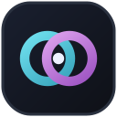
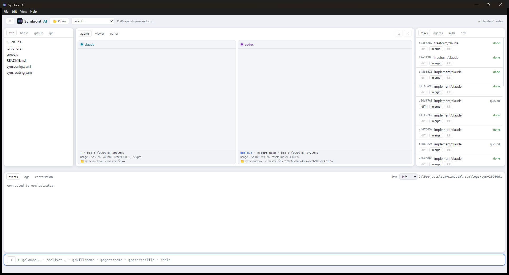

<p align="center">
  
</p>
<h1 align="center">SymbiontAI</h1>
<p align="center"><em>Your choice of AI coding agents, in symbiosis.</em></p>

<p align="center">
  <a href="https://github.com/ESCID94/SymbiontAI-app/releases/latest"></a>
</p>

> **This is the official public download & documentation page for SymbiontAI.**
> The application's source code is private; this repository hosts the releases,
> documentation, and release notes only.

<p align="center">
  
</p>

SymbiontAI is a **local desktop IDE** for **Windows, macOS, and Linux** that runs
**your choice of AI coding agents** side by side on the same codebase and makes
them work *together*: a shared task board, git-worktree isolation per task,
turn-based messaging between the agents, and a **symbiosis loop** where one agent
implements while another independently reviews.

Pick from **five AI CLIs** per project — **Claude Code**, **Codex**, **Gemini
CLI**, **GitHub Copilot CLI**, and **Antigravity** — and mix any of them on the
same team. You bring and authenticate your own CLIs; the app coordinates them.

It is **fully local and offline by design** — no telemetry, no data collection,
no internet exposure. The only network traffic is whatever your own AI CLIs make.

---

## Download

➡️ **[Get the latest release](https://github.com/ESCID94/SymbiontAI-app/releases/latest)**

| Platform | File |
|---|---|
| Windows (x64) | `SymbiontAI-<version>-win32-x64.zip` |
| macOS (Apple Silicon) | `SymbiontAI-<version>-darwin-arm64.zip` |
| Linux (x64) | `SymbiontAI-<version>-linux-x64.zip` |

Direct links to the latest build for each platform:

```
https://github.com/ESCID94/SymbiontAI-app/releases/latest/download/SymbiontAI-win32-x64.zip
https://github.com/ESCID94/SymbiontAI-app/releases/latest/download/SymbiontAI-darwin-arm64.zip
https://github.com/ESCID94/SymbiontAI-app/releases/latest/download/SymbiontAI-linux-x64.zip
```

Unzip anywhere and run it — `SymbiontAI.exe` on Windows, the `SymbiontAI` app on
macOS, the `SymbiontAI` binary on Linux. No installation required. The first
launch opens an onboarding wizard.

> **As of 3.0.0, SymbiontAI runs natively on Windows, macOS, and Linux.** Each
> release ships a build for all three.

### Verify your download

Every release ships a `checksums.txt` with SHA-256 hashes.

```powershell
# Windows (PowerShell)
Get-FileHash .\SymbiontAI-3.0.0-win32-x64.zip -Algorithm SHA256
```

```bash
# macOS / Linux
shasum -a 256 SymbiontAI-3.0.0-darwin-arm64.zip   # macOS
sha256sum SymbiontAI-3.0.0-linux-x64.zip          # Linux
```

Compare the result with the value in `checksums.txt`.

## Requirements

On your machine you need:

- **Your own AI CLIs**, installed and authenticated — at least one of **`claude`**
  (Claude Code), **`codex`**, **`gemini`**, **`copilot`** (GitHub Copilot), or
  **`agy`** (Antigravity). The app drives them and stores no credentials; use any
  one on its own or mix several on the same team.
- **Git.**
- **Node.js 22+** — used for the embedded database. (A build that bundles its own
  Node runtime is available on request, removing this requirement.)

The onboarding wizard checks all of this and shows the exact install/login
commands.

## What it does

- **Live agent sessions** — chatting with an agent is a long-lived, stateful
  session (like an open terminal), not a cold command per message. Sessions
  **survive app restarts**.
- **Conversation history** — every chat is saved locally with a title and
  timestamp; browse and reopen past conversations per agent (🕘), start a fresh
  one (✚), and `/resume` or `/rename` them. Reopening the app restores both panes.
- **Choose your agents** — enable any of **Claude Code, Codex, Gemini, GitHub
  Copilot, and Antigravity** per project; the panes, routing, `@mentions`, and
  statuslines all follow your selection automatically.
- **True parallel work** — dispatch to multiple agents at once, each in its own
  git worktree, with no collisions.
- **Cross-agent communication** — a shared relay lets each agent see what you and
  the other agent have said.
- **Coordinator-driven delivery** — describe a goal and a coordinator decomposes
  it into a reviewable plan and runs a team of specialist agents to ship it.
- **Worktree-isolated coding** — open a writable session in a fresh worktree;
  nothing lands without your review and an explicit merge.
- **Honest statusline** — shows each provider's **real** subscription usage from
  official sources (Claude `/usage`, Codex `/status`) — never an estimate.
- **Customizable workspace** — the agent panes and a tabbed viewer/editor are
  movable panels: arrange them as resizable columns, move any to the right
  sidebar as tabs, hide, or maximize one full-screen. Plus a file tree, syntax
  highlighting, chat attachments (paste screenshots), themes, and GitHub & git
  panels.
- **Built-in SDLC library** — curated, customizable skills and agent personas for
  the software lifecycle.
- **Handoffs (terminal ⇄ IDE)** — move work between a CLI session and the IDE as a
  standardized package (a contract + state + a kickoff prompt), in both
  directions, inert until you say go.

## Privacy & security

- **No telemetry, analytics, or data collection.**
- **No internet exposure** — the internal daemon binds to `127.0.0.1` only; the
  UI is sandboxed under a strict Content-Security-Policy.
- **No credentials stored** — authentication is delegated entirely to your own
  AI provider CLIs.
- **Nothing merges automatically** — you review every change and approve merges.

See [`SECURITY.md`](SECURITY.md) to report a vulnerability.

## License

- **Application:** proprietary **freeware** — free for personal and commercial
  use; the source is not distributed; resale, reverse engineering, and
  modification require written permission. See [`LICENSE`](LICENSE).
- **Documentation, screenshots, and mockups:** Creative Commons Attribution 4.0
  (CC BY 4.0).
- **"SymbiontAI" name and logo:** all rights reserved.

## Feedback

Have feedback, a bug report, or a feature request? Please use our
**[feedback form](https://forms.gle/HdXv729bSPJeta3C8)** — it directly shapes
SymbiontAI. (There's also a **Give Feedback** button at the top of the
[project page](https://escid94.github.io/SymbiontAI-app/).)

## Changelog

See [`CHANGELOG.md`](CHANGELOG.md).
